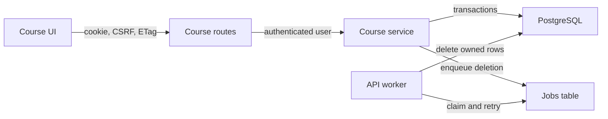

# Courses and memberships

Status: agreed
Date: 2026-09-26

## Context

ChalkTalk has working cookie based authentication and a static home page, but no course or membership endpoints. `documentation/api/courses.md`, `documentation/api/course-memberships.md`, `documentation/openapi.yaml`, and `documentation/database.md` define the intended behavior. The deployed SQL schema is an earlier subset: courses lack lifecycle, join code, creator, and revision fields; membership roles use `teaching_assistant` rather than the documented `ta` value; and there is no jobs table. Course work therefore includes a compatible database migration.

The agreed scope is both API groups and a usable browser course experience. Posts remain a placeholder until their own feature is implemented. A signed in user with the course ID and valid join code may join a course in another organization, as the documented join access rule permits.

## Decision

Implement course and membership operations behind a course domain service using the existing Express API and PostgreSQL pool. Keep the agreed `(course_id, user_id)` membership primary key. Derive the API's required opaque membership `id` deterministically with UUIDv5 from that pair and a fixed application namespace. Store no separate membership ID.

Honor the documented asynchronous course deletion protocol. A request atomically marks the course `deleting` and enqueues a durable job. A worker running in the existing API process claims jobs, removes course owned records, and finally removes the course. The course remains readable with status `deleting` until cleanup finishes, then returns `not_found`.

## Structure

The HTTP layer owns path and body validation, response envelopes, headers, and the existing session, Origin, and CSRF rules. The course service owns membership authorization, course lifecycle, join code checks, optimistic revisions, idempotency, and final instructor protection. Every operation that can add, remove, or change an instructor locks the course row before checking the instructor count, including account deletion in the auth service. Course creation writes the course and creator's instructor membership in one transaction.

The current user belongs to one organization through `users.organization_id`. That relationship authorizes organization course creation and listing. Course membership, including one obtained by cross organization join, authorizes course detail and member reads. Instructor membership authorizes updates, role changes, member removal, and deletion. Hidden or absent resources follow the documented `not_found` behavior.

The membership response ID is UUIDv5 over the canonical course and user UUIDs with an application constant namespace. Its stability survives a process restart and a leave and rejoin. The resource is still addressed by `/courses/{courseId}/members/{userId}`, so this ID is a response field, not an alternate lookup key. The namespace and derivation must remain stable once shipped.

The frontend adds a course API client next to the existing auth client. The protected home page loads the authenticated user's real courses and offers create and join actions. A course detail view shows its state and members, with instructor controls for rename, archive/reactivate, role changes, removal, and deletion; members can leave. The client retains ETags from reads and sends them unchanged with conditional mutations, plus the in memory session CSRF token. After a version conflict, it refreshes the resource and asks the user to retry. Existing History API routing remains sufficient; no new state or routing dependency is needed.

## Persistence and compatibility

Add forward only SQL migrations to bring the existing tables to the documented course model and create the durable jobs table. Backfill existing rows conservatively: infer a creator only from an existing instructor, and stop with an actionable migration error if a nonempty legacy course cannot meet the new invariant. Convert legacy `teaching_assistant` roles to `ta` while preserving instructor rows. Existing auth queries that inspect instructor memberships must continue to work and follow the shared course row locking protocol.

Deletion jobs are inserted in the same transaction that changes course status. The worker claims available jobs with `FOR UPDATE SKIP LOCKED`, uses a lease so a crashed process can be retried, and makes cleanup idempotent. Current cleanup covers the course and memberships actually stored today. When posts, collaboration data, search records, or stored files are introduced, their owners extend the cleanup operation before those features ship. A failed cleanup keeps the course in `deleting` and retries; the job records a terminal failure for operator inspection after its retry limit.

## Technology choices

| Concern                | Choice                                                  | Why                                                       | Runner up                                           |
| ---------------------- | ------------------------------------------------------- | --------------------------------------------------------- | --------------------------------------------------- |
| API and persistence    | Existing Express, `pg`, PostgreSQL                      | Matches running auth implementation and transaction model | New ORM adds migration and dependency cost          |
| Membership response ID | UUIDv5 from composite key using existing `uuid` package | Preserves both the agreed key and documented API field    | Surrogate ID changes the agreed schema              |
| Deletion worker        | Database jobs claimed inside API process                | Durable retries without another deployed service          | Dedicated worker increases deployment parts now     |
| Browser state          | Existing React state and History API                    | Course views fit current navigation model                 | Router/state library adds an unnecessary dependency |

These choices use dependencies already present in the repository; no new library is proposed.

## Alternatives rejected

- Synchronous deletion: it cannot provide the documented `202` response and observable `deleting` state.
- In memory deletion queue: process restart could strand a course indefinitely.
- Membership surrogate primary key: conflicts with the approved composite key for no current lookup need.
- Restricting joins to the user's organization: the join API explicitly grants access to any signed in user with the course ID and code.

## Failure modes

- If PostgreSQL is unavailable, API operations return the documented service error and deletion jobs remain durable until it recovers.
- If a worker crashes or cleanup fails, the lease expires and the job is retried. The course remains `deleting`; no new joins or edits are accepted.
- If two users change an instructor membership concurrently, the course row lock serializes the final instructor check. Stale `If-Match` values produce `version_conflict`.
- If a browser request fails or a page cursor becomes invalid, the UI keeps the current view and offers a retry; it does not assume a mutation succeeded.

## Reversibility

The public course and membership response shapes, cross organization join rule, membership ID derivation, and stored lifecycle states are expensive to change after clients use them. The worker's process placement, frontend component layout, and internal service files are cheap to change.

## Verification seams

API tests exercise the documented success bodies, headers, auth/CSRF, hidden resources, invalid inputs, pagination, idempotency, ETags, last instructor races, join codes, and deletion lifecycle against PostgreSQL. Frontend client tests check request paths, credentials, conditional headers, and error envelopes. React Testing Library tests cover loaded, empty, loading, error, create, join, detail, role gated actions, stale revision recovery, and deletion polling as observable behavior.

## Open questions

No structural decision remains. Planning should inspect any legacy course rows before finalizing the migration's backfill procedure.
