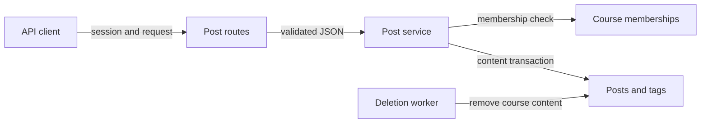

# Text-only posts API phase

Status: agreed
Date: 2026-09-27

## Context

`documentation/api/posts.md`, `documentation/api/identity-visibility.md`, `documentation/openapi.yaml`, and `documentation/database.md` describe a larger target posts system. This phase deliberately implements only text-based `question` and `note` posts: JSON create, list/search, get, JSON update, and delete. It includes tags, duplicate suggestions/review, pinning, anonymity, ETags, idempotent creation, pagination, and tombstones. Tests prioritize functionality, selected error paths, identity visibility, and course isolation. No browser posts UI is in scope.

Poll creation/voting, multipart uploads, attachments, SeaweedFS, downloads, and URL refresh are deferred. The earlier SeaweedFS and API-mediated-download decisions remain candidates for an attachment phase, not infrastructure to deploy now. The work is on a separate `implement-posts-api` branch based on the open courses PR, so the course PR remains unchanged.

## Decision

Add a post service within the existing Express API, with PostgreSQL as the sole datastore for this phase. The service owns post and tag state, membership and field-level authorization, revisions, viewer-aware identity projections, and list/filter/cursor semantics. Routes own session, Origin/CSRF, JSON validation, response envelopes, and headers. Do not introduce object storage, a multipart parser, poll tables, or vote routes in this phase.

Every operation resolves its course and verifies the authenticated user's *current course membership*. On global `/posts/{postId}` paths, the post's `course_id` determines the authorization scope. A member of Course A cannot read or mutate a Course B post even with its ID; a nonmember cannot access either course's posts. Absent and hidden IDs share the same `404` outcome. Organization affiliation never substitutes for course membership, as cross-organization joins are supported.

## Structure

Authorization for global IDs must happen before a representation or permission-specific error can reveal a hidden post. Mutations check membership and author/staff permissions inside a transaction, lock the target post, then apply the `If-Match` revision check. Post creation is a single transaction that writes the post and its tag links and stores an idempotency result when a key is supplied. Archived or deleting courses remain readable to members but reject post writes under the documented lifecycle rule.

### Identity visibility and listing

Store the real `author_user_id` and `anonymous` flag. Construct the `Author` response separately for each viewer; never cache or reuse an already redacted representation across users. Named live authors show their ID and display name. Anonymous authors are named only to themselves and course staff; another student sees `userId: null` and `displayName: "Anonymous"`. A soft-deleted author shows `userId: null`, `displayName: "Deleted user"`, and `deleted: true`, while the original anonymity flag remains. Tombstones have no author projection.

Exclude deleted posts from every course list, whether unfiltered or filtered. Apply `authorId` visibility in SQL *before* full-text ranking, sorting, pagination, `limit + 1`, and `hasMore`. Staff may match every active post by an author; students may match named posts and their own anonymous posts, but not someone else's anonymous posts. An all-hidden match yields an empty `200` collection with no pagination hint. No search field, count, or ranking explanation may reveal a hidden author. A deleted post remains accessible only through direct GET by ID to a current course member.

Use PostgreSQL generated `tsvector` and a GIN index for title/body search. `q` implies relevance ordering by default; without `q`, default to recent activity. The documented filters compose with search: type accepts only `question` and `note` in this phase, repeated `tag` values use OR semantics, and date/answered/duplicate filters retain their documented meanings. No answer table exists in this phase, so question posts project `answered: false` and an `answered=true` filter returns an empty list; a later answer phase replaces this with a derived answer-existence check. Cursors bind the course, viewer, sort, and normalized filter set, with a stable ID tie-breaker; a cursor from another collection or query is invalid.

### Persistence and lifecycle

Introduce the documented `posts`, `tags`, and `post_tags` relationships needed now. `posts.type` permits only `question` or `note` for this phase; a future poll migration can extend the type constraint. Keep the documented same-course `(course_id, id)` key and duplicate foreign key. Normalize tag names per course and link them to posts. The application checks that each post/tag pair belongs to the same course, as `database.md` requires. Do not create `poll_options`, `poll_votes`, or `attachments` solely for this phase.

Any course member may suggest a duplicate of another active post in the same course. The author or staff may edit title, Markdown body, anonymity, and tags. Staff alone may confirm/clear duplicate review and change `pinned`; ordinary members cannot use suggestion permission to edit content. Reject self-duplication and cross-course targets. Optimistic ETags prevent stale updates/deletes. Idempotency keys for creation retain matching results for the documented 24 hours and reject reuse with a different request.

Deletion leaves a minimal tombstone so future nested content can retain a stable parent. It clears title, body, and author identity, retains the original `question` or `note` type, increments the version, and exposes only `id`, `courseId`, `type`, `deleted: true`, `createdAt`, `updatedAt`, and `version`. The existing asynchronous course-deletion worker must remove post/tag rows before it removes the course, with retry-safe cleanup. There are no stored file objects to clean in this phase.

`post_view_events` is not needed for these endpoints: neither `GET` route promises a view side effect or returns a view count. The table belongs to a future statistics phase. Historical views from this first phase will not be reconstructable; that is an explicit accepted limitation, not a reason to add writes without a defined counting policy.

## Contract status for deferred behavior

Keep `documentation/api/posts.md` and `documentation/openapi.yaml` as the long-term target contract; do not silently delete poll, multipart, or attachment definitions. I recommend prominent implementation-status notes in both, identifying the currently supported routes and media/type variants and listing deferred ones, but changing these canonical references needs the user's approval. The OpenSpec change for this branch should define the *phase acceptance* contract, including the expected rejection for unsupported poll and multipart requests. Tests should assert that agreed phase contract while continuing to use the target definitions for implemented fields. Once later phases ship, remove or revise any status notes; do not describe this PR as full posts-API conformance.

The target PATCH text says “author or staff” while also saying members may suggest duplicates; align its permission wording with the agreed member-suggestion rule. Add hidden-resource `404` to mutation documentation where omitted, and correct the tombstone example's duplicate `deleted` keys. These are contract clarifications, not removal of deferred functionality.

## Technology choices

| Concern | Choice | Why | Runner-up |
| --- | --- | --- | --- |
| API and persistence | Existing Express, `pg`, PostgreSQL | Reuses sessions, transactions, course memberships, and jobs | New service or ORM adds an unnecessary boundary |
| Search | PostgreSQL full text (`tsvector`/GIN) | Meets `q` and relevance needs without another datastore | External search index adds synchronization and operations |
| Background cleanup | Existing durable course-deletion worker | Keeps course cleanup retryable | Synchronous deletion contradicts course lifecycle |

No new runtime dependency or external service is required in this phase. SeaweedFS, a streaming multipart parser, and an S3 client are deferred with attachments.

## Alternatives rejected

- Implementing polls or votes now: outside the narrowed phase and requires additional state/response variants.
- Shipping multipart endpoints that ignore files: would falsely claim adherence to the documented attachment contract.
- Deploying SeaweedFS before any attachment route uses it: adds operational surface without a current benefit.
- An external search engine: introduces duplicate state and index consistency before it is needed.
- Row-level security as the sole guard: current service-level authorization and viewer-dependent projections still require application logic.

## Trade-offs accepted

The target OpenAPI file will describe future operations not yet supported; the phase OpenSpec makes that gap explicit, and the recommended implementation-status annotation would make it visible in the canonical reference too. Historical post views cannot be reconstructed when the later statistics feature begins. `answered` has no true case until answer content is implemented. PostgreSQL text search is sufficient for this phase, not semantic search.

## Failure modes

- PostgreSQL unavailable: post operations fail as a service error; no content or identity projection is fabricated.
- Membership revoked or course hidden: later reads/mutations fail closed, including global-ID routes, without disclosing the target's existence.
- Concurrent edits: the post row lock and `If-Match` produce a version conflict rather than silently overwriting.
- Expired or wrong-query cursor: return `invalid_request`; never continue from a different course, viewer, or filter.
- Course cleanup fails: the deletion job retries and the course remains `deleting` until cleanup succeeds or the job records a terminal failure.

## Reversibility

Expensive to change after release: public active/tombstone/author shapes, `404` privacy behavior, per-course keys, and the member-suggestion permission. Cheap to change: internal service layout, index tuning, and eventual search implementation. Poll and attachment schema remains uncommitted in this phase.

## Verification seam

Exercise the HTTP routes against an isolated migrated PostgreSQL schema with injected session identities and real database course memberships. The existing authentication suite separately exercises real session handling; post tests exercise route session/CSRF guards, membership authorization, and persistence. Assert creation, read/list/search, update/delete, tags, duplicate/pin permissions, idempotency, ETag and course lifecycle behavior, plus selected validation/CSRF errors. The primary matrix is author, other student, TA, instructor, deleted author, nonmember, and a Course A member probing a Course B post through both course-scoped and global-ID routes. Check anonymous and tombstone projections and prove that `authorId` filtering occurs before pagination and `hasMore`. Keep tests focused on observable results and the agreed phase contract, not private service implementation.

## Open questions

The user should approve or reject adding implementation-status notes to the canonical Markdown and OpenAPI references. The alternative is to leave those references unchanged and rely on the phase OpenSpec and PR description; that avoids touching the long-term contract but makes the deployed subset less discoverable to readers and generated clients. Planning should also define the precise rejection codes for deferred type/media variants in the phase contract. If historical view counts become a requirement before the statistics phase, revisit the decision to omit `post_view_events`.
