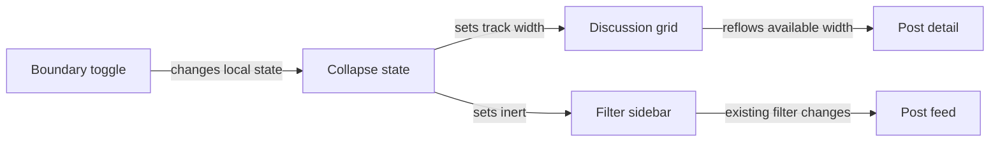

# Collapsible discussion filters

Status: agreed
Date: 2026-09-29

## Context

The course discussion uses a three-column desktop grid: filter sidebar, post feed, and post detail. At widths of 850px or less, the grid becomes a stacked layout and opening a post hides both the filters and feed. The user wants the left filter sidebar to collapse with a two-chevron control on its right boundary, pointing left to collapse and right to expand, with a smooth transition.

The user chose desktop-only collapse, an expanded default on each visit, and no saved preference. Existing Show, Sort by, and tag filtering behavior must remain intact.

## Decision

Keep collapse state local to the discussion view. On desktop, animate the filter grid track between its current width and zero. Keep the post feed and detail columns mounted, so changing the sidebar width does not reset their selection, scroll position, or fetched data. Place the toggle over the boundary between filters and feed, outside the shrinking sidebar, so it remains operable at zero width.

On mobile, show the existing stacked filters and hide the toggle. A desktop collapse state has no effect on mobile; resizing back to desktop restores that state until the discussion view unmounts. Each new visit starts expanded.

## Structure

The discussion component owns a Boolean collapsed state. The state changes only presentation; filter values continue through the existing URL or local filter path, and no network request occurs solely because the pane opens or closes. The desktop grid retains its three tracks; its first track becomes zero when collapsed, while the feed keeps its current width rule and the detail takes the released space.

Use a real button with an accessible name that changes between “Collapse filters” and “Expand filters,” plus `aria-expanded` and `aria-controls` for the sidebar. A two-chevron icon rotates or swaps direction with state. The button stays on the sidebar/feed boundary in both states and remains keyboard reachable. When collapsed, the sidebar is clipped and made inert so its selects and tag control cannot receive focus or be announced while hidden. Expanding restores them without clearing selections.

The track width, boundary control position, and icon change animate over one short interval. Existing `prefers-reduced-motion` styling reduces the duration for people who request it. Mobile keeps its current stacked layout, including the existing rule that hides filters and feed while a detail view is selected.

## Technology choices

| Concern | Choice                                           | Why                                                                  | Runner-up                                                 |
| ------- | ------------------------------------------------ | -------------------------------------------------------------------- | --------------------------------------------------------- |
| State   | React state in the existing discussion component | State is local and resets on each visit                              | URL or storage would retain an unwanted preference        |
| Motion  | CSS grid and position transitions                | Fits the current three-column layout and avoids measuring DOM widths | JavaScript animation adds synchronization and resize work |
| Icon    | Inline two-chevron SVG                           | Crisp at any size and exposes one accessible button name             | Text glyph shape depends on the active font               |

No new dependency, API, or stored data is needed.

## Alternatives rejected

- A narrow collapsed rail: it reserves horizontal space even though the filters are fully hidden; the boundary button can remain visible without it.
- Collapsing on mobile: the mobile filters already sit above the feed rather than alongside it, so a boundary arrow would have no stable right edge.
- Persisting the state: the user chose an expanded sidebar on every new visit.

## Failure modes

- If animation is disabled or unsupported, the layout switches immediately and the toggle still works.
- If the view resizes across 850px, CSS restores the mobile layout without changing filter data or the current post selection.
- If the sidebar is collapsed, its controls are removed from keyboard and assistive-technology navigation until expanded; the boundary button remains available to restore them.

## Reversibility

The collapse state, CSS track behavior, and icon are local UI choices and cheap to change. There is no public API, persistence format, or migration.

## Open questions

None for the structural design. Visual placement and exact transition duration can follow existing styling conventions during implementation.
