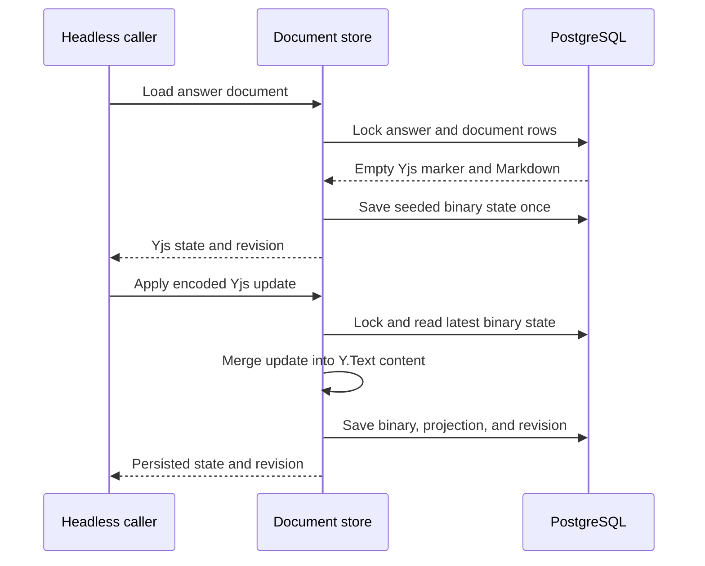

# Yjs answer document core

Status: agreed
Date: 2026-10-09

## Context

The [system design](../../documentation/design.md) calls for Yjs documents backed by PostgreSQL, and the [answer API reference](../../documentation/api/answers.md) says existing answers have a persistent Yjs document. The implemented answer creation transaction inserts `answer_collaboration_documents.yjs_state` as the empty Yjs update `[0, 0]` while `answers.body_markdown` holds the initial text. The private document store seeds that state on first access.

The agreed first slice is an **isolated, headless Yjs core**. It must load and persist answer documents, merge binary Yjs updates, and keep the answer's Markdown projection consistent with the saved CRDT state. Tests exercise the core module directly with real PostgreSQL. This slice has no ticket API, Hocuspocus server, WebSocket endpoint, temporary collaboration sessions, Compose service, or editor UI. Existing REST answer behavior remains usable without the new module.

Assumption: the module is private backend code. A future transport must authenticate and authorize a caller before using it; this slice does not expose it as a public endpoint. The module still enforces answer and document lifecycle so callers cannot write an endorsed, deleted, or closed document by mistake.

## Decision

Use `yjs` 13.x to store the complete binary document in `answer_collaboration_documents.yjs_state`. The document's editable text is `Y.Text('content')`, matching the published collaboration snapshot projection. On first access to an existing empty document, seed that text from `answers.body_markdown` exactly once. Thereafter Yjs binary state is authoritative and `answers.body_markdown` is its read projection.

Expose a narrow internal document store with operations to load an answer document and apply an encoded Yjs update. The store owns binary decoding, merge, projection, persistence, and lifecycle checks. It returns the resulting state and revision to headless callers; callers never edit `yjs_state` or `body_markdown` independently. It does not implement socket or session behavior.

## Structure

PostgreSQL is the durable authority. `answer_collaboration_documents` holds the Yjs update, persistence timestamp, and persistence revision. `answers.body_markdown` remains the REST-facing Markdown projection. A transaction locks the answer and document rows in a consistent order, reads the latest state, applies the incoming update to a Yjs document, computes `Y.Text('content').toString()`, validates the existing answer length constraint, then writes binary state and projection atomically. This read-merge-write sequence prevents two independent callers from overwriting each other's accepted updates. A duplicate update that changes no Yjs state does not advance the persistence or answer revision.

The initial seed is part of the same serialized transaction. If `yjs_state` is the existing empty marker, the store inserts the current `body_markdown` into `Y.Text('content')` and saves the encoded Yjs state. Once seeded, the store must never reconstruct the document from Markdown: doing so would discard CRDT history and could duplicate edits when updates merge. A nonempty Yjs state whose text disagrees with `body_markdown` is an integrity error; the store rejects the operation without changing either representation.

The module rejects loads and writes when the answer or its parent post is deleted, the parent post is a confirmed duplicate, the answer is endorsed, the document lifecycle is not `active`, or the course is not active. It rechecks those conditions inside the persistence transaction, so a caller cannot bypass the guard by loading earlier and saving after a lifecycle change. A future authenticated transport will additionally check the user's course membership and role at its boundary. The store accepts no identity claims or permissions from an unauthenticated network request because this slice has no network request path. When a real editor is integrated, it must supply an authenticated editor identity so changed documents can record contributors; that integration must be designed at the transport boundary.

The store performs durable writes before returning success. There is no in-memory dirty-document cache or debounced persistence in this slice. Existing endorsement and deletion operations can continue without a running collaboration process; their lifecycle changes block any later core-store update. For a race between an edit and endorsement/deletion, row locks order the transactions: whichever commits first determines the state seen by the other. An edit accepted before finalization is durable and reflected in the projection; an edit arriving afterward is rejected. A later Hocuspocus process may add a debounced cache, but it will need a separate final-flush design before it can claim the same finalization guarantee.

## Technology choices

| Concern        | Choice                                                   | Why                                                                                   | Runner-up                                                                  |
| -------------- | -------------------------------------------------------- | ------------------------------------------------------------------------------------- | -------------------------------------------------------------------------- |
| CRDT           | `yjs` 13.x, `Y.Text('content')`                          | Matches the documented text projection and allows independent binary updates to merge | Plain text overwrites lose concurrent edits                                |
| Persistence    | Existing PostgreSQL answer document and answer rows      | Transactionally keeps CRDT state and REST projection together                         | File or in-memory storage bypasses existing answer lifecycle               |
| Merge boundary | Internal TypeScript document store                       | Testable without transport; one owner of encoding and projection                      | Put Yjs logic in REST handlers or a future socket hook                     |
| Verification   | Headless Yjs documents with PostgreSQL integration tests | Exercises real binary merge and restart/load behavior                                 | Mock-only tests cannot prove state survives or concurrent updates converge |

Version and maintenance checked 2026-10-09: the npm registry lists Yjs 13.x as stable; this change installs a 13.x release. Source: [Yjs package](https://www.npmjs.com/package/yjs). This slice does not add Hocuspocus or its provider.

## Alternatives rejected

- Build tickets and a Hocuspocus/WebSocket server now: the user chose to prove the CRDT and PostgreSQL layer first.
- Start with temporary post or subchannel sessions: those anchors and persistence tables are not implemented.
- Recreate a Yjs document from `body_markdown` on every load: it loses CRDT identity and can duplicate content when updates arrive.
- Store only a Markdown projection: concurrent Yjs updates cannot be reliably merged after their binary history is discarded.
- Add a debounced in-memory write cache in the core: it creates a crash-loss window and requires coordination with answer endorsement and deletion that this isolated module does not need.

## Trade-offs accepted

- Every applied update performs a PostgreSQL transaction. This favors correctness and isolation tests over edit throughput; a later live server can batch writes under a new durability contract.
- No caller authentication, live presence, socket synchronization, or UI is delivered. The core module is not a public editing API.
- The document stores plain Markdown text in `Y.Text('content')`. Rich-text structures would require a new format and migration decision.

## Failure modes

| Failure                                                                                                     | Response                                                                                                       |
| ----------------------------------------------------------------------------------------------------------- | -------------------------------------------------------------------------------------------------------------- |
| PostgreSQL unavailable or transaction fails                                                                 | The update reports failure; no partial binary/projection write is committed.                                   |
| Malformed Yjs update or decoded document                                                                    | Reject it without changing stored state and report a diagnostic error.                                         |
| Answer endorsed or deleted, parent post deleted or confirmed duplicate, course inactive, or document closed | Reject the load or update without modifying binary state, projection, or contributors.                         |
| Two callers edit from the same earlier state                                                                | Serialize database writes; Yjs merges each update against the latest saved state. Both edits survive if valid. |
| Initial seed attempted concurrently                                                                         | Row lock allows one seed; later loads use the persisted binary state.                                          |
| Projection differs from binary state                                                                        | Report an integrity error without modifying either representation.                                             |

## Reversibility

The module interface and test harness are cheap to revise before a network transport depends on them. `Y.Text('content')`, the binary persistence format, and the rule that Yjs owns the answer projection are expensive to change once saved documents exist; a future format change requires an explicit migration.

## Open questions

- The future transport must settle ticket authentication, live revocation, awareness identity, buffering, and process shutdown before public editing is available.
- The future live server must choose a durability and final-flush contract for cached updates before integrating with endorsement and deletion.
