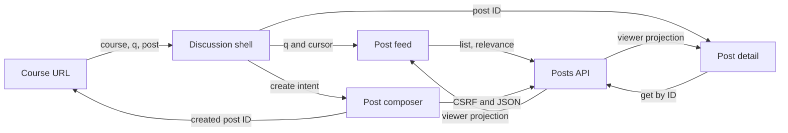

# Course discussion frontend

Status: agreed
Date: 2026-09-27

## Context

The existing React/Vite frontend has a `/courses/:courseId` page devoted to members and course administration, while the API now supports text-only question and note posts. The home page's discussion card is placeholder content. This phase gives course members a Piazza-inspired discussion surface: rectangular post cards on the left with title and body excerpt, search and a create control above the feed, and a selected post on the right. It does not add polls, attachments, answers, or a cross-course home feed.

The existing API remains authoritative for membership, identity visibility, ranking, pagination, and write permissions. Its PostgreSQL `websearch_to_tsquery('english', q)` behavior is lexical full-text search, not semantic similarity. The user explicitly confirmed the one-way example that a query `A cutoff` should find a post containing `Cutoffs for the course`; no reverse-direction or fuzzy-synonym requirement was agreed.

## Decision

Make `/courses/:courseId` the discussion-first page. A left column owns search, the `+ Create post` control, and a cursor-paginated list of question/note cards. A right column shows the selected post, or a helpful selection prompt when none is selected. Preserve current member and course-management capabilities behind an explicit **Course settings** view rather than leaving them above the discussion feed. The course remains the authorization boundary in every frontend request.

Use the existing lightweight route mechanism, React local state, and same-origin `fetch`; no client-side data store, search service, or router dependency is warranted. Add `react-markdown` for safe detail rendering, without raw-HTML support. Card titles and excerpts remain escaped text.

## Structure and data flow

`/courses/:courseId` is the feed route. `/courses/:courseId/posts/:postId` is a shareable selected-post route. Both accept an optional `q` query parameter. Selecting a card carries the active `q` into the detail URL; browser back/forward restores the selection and submitted search. The create composer is an in-page panel or dialog, not a new route. A separate `/courses/:courseId/settings` route houses the existing members, join code, membership changes, archive, rename, deletion, and leave controls. This keeps the discussion route focused while retaining the current administrative functionality. A course name/header and clear Discussion/Settings navigation remain visible in both views.

On wide screens, the feed and detail occupy adjacent columns. On narrow screens, the feed and detail become separate views keyed by the same URLs, with a visible **Back to posts** action; the create form remains usable at narrow widths. Do not rely on hover for card selection or action discovery. Cards are keyboard-operable links with a visible focus state and a selected state. The `+` icon has an explicit accessible name such as **Create post**.

The frontend posts client sends cookies with `credentials: include`. Creation is JSON with the session's CSRF token and a fresh idempotency key; it sends only `question` or `note`, title, Markdown body, anonymity, and optional tags. The composer offers those fields with validation aligned to the existing API: trimmed nonempty title (maximum 200 characters) and trimmed nonempty Markdown body (maximum 100,000 characters). It disables repeat submission while pending, preserves the draft on failure, and navigates to the created post after success. The server's returned post, not an optimistic invented object, becomes the detail source. An archived/deleting course does not show an enabled create action; a concurrent status change may still produce `409 course_archived`, which is displayed without discarding the draft.

While either composer text field changes, the composer independently offers up to ten **Related questions** in a scrollable panel below the draft. This is not the main feed search: after a 300 ms pause, request the existing course list endpoint with `type=question`, `sort=relevance`, `limit=10`, and a bounded generated `q`. The suggestion query uses the **entire current title**, not only its first or last few words, plus a small sample of body terms near the most recent body edit. Specifically, extract Unicode letter/digit word tokens from all title text, retain every distinct token of at least two code units except the literal word `or`, and join them in title order with literal ` OR `. Append up to four recent body tokens of the same minimum length, each capped at 40 code units and distinct from existing query tokens, while keeping `q.length <= 500`. Reserve space for at least one eligible body token before adding any more; the 200-character title limit and two-character token minimum bound the title branch to fewer than 400 code units, so one capped body token always fits. If no eligible term exists, clear suggestions without making a request. Tokens are lowercased and rebuilt from letters/digits, so quotes, minus signs, and typed `OR` syntax in a draft cannot inject search operators. The generated `OR` makes this a candidate-finding query; the API's PostgreSQL relevance order remains authoritative. The body is not sent wholesale: a 100,000-character draft would exceed the API's 500-character `q` limit and, if treated as an AND query, would likely eliminate useful matches. This design interprets **full title** as all searchable lexical title words; punctuation, one-character words, literal `or`, and PostgreSQL English stop words cannot be promised as independent matches. There is no guaranteed title weighting in the current API because the database combines title and body in one unweighted search vector.

The panel shows only the server's course-authorized question results, titles and short escaped excerpts, a loading/empty/error state, and a clear close control. Cancel or invalidate superseded suggestion requests so old drafts cannot overwrite newer suggestions. For pointer use, leaving the suggestion region dismisses it, but this must not close a panel while keyboard focus remains inside; Escape, focus leaving the composer/panel, and the close control dismiss it for keyboard and touch users. Focus and hover can reopen suggestions without losing the draft. Each result is an ordinary link to `/courses/:courseId/posts/:postId` with `target="_blank"` and `rel="noopener noreferrer"`, so inspecting an earlier question does not destroy the current unsent draft. The panel is supplementary: it never blocks creation and never makes a claim of semantic similarity or duplicate certainty. Only an in-progress `question` draft shows question suggestions; a `note` draft has no related-question panel.

The feed calls `GET /api/v1/courses/:courseId/posts`. With no submitted query it uses the API's recent-activity default. On a nonempty submitted query it sends trimmed `q` and `sort=relevance` explicitly; the API ranks and filters results. The **main feed** search field plus Search button submits on Enter/click rather than issuing a request per keystroke; the composer-related panel is separately debounced as described above. The submitted feed query is stored in the URL; editing the composer draft does not mutate the feed results. Empty submission clears `q` and returns to the unfiltered feed. Keep the query syntax visible in a short helper: words, `"quoted phrases"`, `OR`, and `-excluded` terms. Pass manually entered feed search text to the API unchanged apart from edge whitespace trimming and URL encoding; do not introduce a competing client parser or semantic-search promise.

The feed owns `items`, `nextCursor`, initial loading/error, and load-more pending/error state for a single `(courseId, submitted q)` identity. On course or q change, clear items and cursor before loading page one. A subsequent page appends only for the same identity, de-duplicates by post ID defensively, and retains current cards if the page fails so **Retry loading posts** can retry the same cursor. Disable duplicate page requests. Abort or invalidate obsolete requests so a slow response from an earlier course/query cannot replace newer results. A successful create resets the feed to page one for the current query; the new post may legitimately not appear if it does not match that query, but its detail route still opens. Do not splice it into a relevance-ranked list locally.

The detail fetches `GET /api/v1/posts/:postId` independently of whether its card is in the current page. This supports direct links, pagination, and search-result changes. Verify that the returned `courseId` matches the URL course before rendering; the API also enforces membership. A tombstone response uses the documented minimal shape and displays a neutral **This post was deleted** state, never content from a previous selection. `404` or lost membership produces an unavailable message without leaking previous post content or author data. Author names and anonymity come from the API's viewer-specific `author` object; the browser never infers or reconstructs hidden identity. Rendering `bodyMarkdown` through `react-markdown` excludes `rehype-raw` and any unsafe HTML insertion. Restrict or use the renderer's safe default URL handling for links; executable protocols must not become clickable. The card excerpt is a short, escaped text preview of the body, with truncation indicated visually; it is not parsed as search metadata or an identity source.

Only create and read interactions are in this UI phase. The API's update/delete, pin, and duplicate endpoints remain available for a later interface. Do not imply answers or reply counts are live: current question posts report `answered: false` until answers exist.

## Search contract and verification examples

The public seam for search correctness is the HTTP API against PostgreSQL, not a mocked search algorithm in React. Frontend interaction tests prove that submission constructs the intended `q`/`sort=relevance` request, uses URL encoding, resets pagination, handles stale responses, and renders the server's returned order. PostgreSQL-backed tests prove language behavior using real title/body rows and the endpoint:

| Stored post text | Query | Expected |
| --- | --- | --- |
| `Cutoffs for the course` | `A cutoff` | Match: English stemming equates `cutoffs` and `cutoff`; articles are stop words. |
| `A cutoff` | `Cutoffs for the course` | No match required: `course` is missing. |
| `The assignment cutoff is Friday` | `cutoff` | Match in body text. |
| `Office hours moved to Friday` | `"office hours"` | Match the quoted phrase. |
| `Office hours moved to Friday` | `office -friday` | No match due to exclusion. |

These are functional examples, not a requirement for semantic embeddings, fuzzy spelling, or bidirectional equivalence. The API's relevance rank, rather than frontend string matching, determines order. A dedicated multi-hit test should assert returned order or at least that the frontend preserves the API's order; avoid hard-coding PostgreSQL score internals into the UI tests. Composer tests additionally assert that a changed title and a changed body context can each alter the bounded generated query, the full title is represented even at 200 characters, draft punctuation cannot become an operator, a 100,000-character body never produces `q` over 500 characters, the request is question-only with `limit=10`, superseded results do not flash, and selecting a suggestion opens a safe new-tab link while the draft remains.

## Technology choices

| Concern | Choice | Why | Runner-up |
| --- | --- | --- | --- |
| UI and routing | Existing React and small browser-history router | Fits current app and preserves deep links without a second routing model | React Router adds a dependency for a small route tree |
| Search | Existing PostgreSQL full-text API | Membership-aware ranking and pagination already live | Browser filtering would be incomplete and leak semantics |
| Markdown display | `react-markdown` 10.1.0, no raw HTML plugin | Maintained React renderer; avoids `dangerouslySetInnerHTML` for user content | Plain text loses author formatting |
| Interaction tests | Existing Vitest, jsdom, React Testing Library | Tests observable controls and network contract | Screenshot-only tests miss request and pagination behavior |

Version and maintenance checked on 2026-09-27 against the [upstream `react-markdown` repository](https://github.com/remarkjs/react-markdown). The upstream package lists version 10.1.0 and documents raw HTML as an explicit opt-in through `rehype-raw`; this design does not opt in.

## Alternatives rejected

- Keeping course administration above the feed: forces discussion below a long management section and works against the requested left-list layout.
- Local-only selected-post state: breaks direct links, refresh, and browser back/forward.
- Main-feed search on every keystroke: creates unnecessary requests and makes URL/result state harder to reason about; submit behavior is predictable. The composer suggestion panel is intentionally debounced after text edits.
- Client-side search/ranking: cannot reproduce PostgreSQL stemming, authorization-aware filtering, or cursor relevance order.
- Optimistically inserting created posts into a search page: may violate ranking and match semantics.
- Rendering Markdown by injecting HTML: unnecessary script/link security exposure for user-authored content.

## Trade-offs accepted

The interface is text-only and does not expose every post-management capability in the API. Search remains lexical and sometimes asymmetric: `A cutoff` can find `Cutoffs for the course`, but the reverse is not guaranteed. Related-question suggestions favor recall with an OR query and may include loosely related matches; neither semantic similarity nor title-weighted ranking is available from the current endpoint. The existing home-page placeholder discussion card is not turned into a cross-course feed in this phase. Cursors are session state, so a refreshed page restarts from page one, while the durable `q` and selected post remain in the URL.

## Failure modes

- Slow or out-of-order list responses: cancel/ignore stale requests; never mix results/cursors from different courses or queries.
- Slow or out-of-order related-question responses: cancel/ignore stale requests when draft text, post type, course, or panel visibility changes; never display another draft's suggestions.
- A later page fails: retain already displayed cards and expose a retry for the same cursor.
- A direct post request returns 404, a tombstone, or a different course: clear prior detail immediately and show the appropriate unavailable/deleted state; do not retain stale author/content.
- Session expires or membership is revoked: API rejects requests; show the error and rely on the existing session/route flow rather than exposing cached protected content.
- Create fails after submission: keep the draft, show the API error, and allow a deliberate retry. Reuse the same idempotency key for retries of the same payload; generate a new key if the payload changes.
- Markdown is hostile or malformed: React escapes raw HTML, unsafe links cannot execute, and malformed syntax remains visible as text rather than code.

## Reversibility

The shareable route shape and the expectation that search state is URL-addressable are public, relatively expensive choices. The split proportions, card styling, form presentation, and Markdown renderer are replaceable within the same contract. Lexical search can later be improved server-side without a frontend search protocol change, but any changed matching promise needs its own API contract and tests.

## Open questions

None blocking planning. The exact visual proportions, excerpt length, and whether the create surface is an inline panel or accessible dialog are presentation details to settle during UI implementation, without changing these boundaries.
