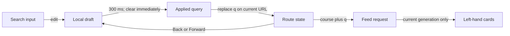

# Live course-post search

Status: proposed
Date: 2026-09-27

## Context

The course discussion currently searches only after form submission. The user wants results to update while typing, without a Search button. The existing list API accepts a course-scoped `q` (at most 500 characters) and `sort=relevance`; it interprets PostgreSQL web-search syntax. Search state is already represented by `q` in both course and selected-post URLs. The discussion component is currently keyed by course *and query*, so naively updating the route on every search would remount it and lose a selected post or unsent composer draft.

This change does not alter the API, search semantics, left-column width, or related-question suggestions in the composer. The course heading becomes about 10% larger, retaining its monospace font and responsive sizing.

## Decision

The search input updates its local value on every edit. After 300 ms without another edit, apply its trimmed value as the course feed query; clearing the field returns to the unfiltered feed immediately. A nonempty query is sent unchanged apart from edge trimming, URL encoding, and the existing 500-character limit. In particular, preserve quoted phrases, `OR`, and excluded terms rather than parsing or rewriting them in the browser. Remove the Search button; Enter is not required to trigger search.

Update `q` on the **current** course or selected-post URL using `replaceState`, then synchronize the route state. Edits do not create one browser-history entry per query; Back/Forward still works for actual navigation and restores the URL's query. The current post selection or open composer stays visible while only the left feed changes. Search edits are not attempts to leave the composer and must not invoke draft-discard confirmation.

Make the discussion instance stable across query changes (key it by course, not `q`). Keep the input draft locally and use the route `q` as the applied, shareable feed query. Route changes caused by Back/Forward or navigating to another course synchronize the field from `q`. A query change resets first-page results and cursor; a request generation and abort signal prevent older first-page responses from replacing current results. Later-page responses are likewise ignored if their course/query generation is stale. Retain the current selected post and its independently fetched detail even if it is absent from the new feed.

## Alternatives rejected

- Fetching on every keypress: unnecessary requests and greater response-race pressure with no useful UX gain over a short debounce.
- `pushState` for each edit: Back would step through every intermediate query instead of returning to the previous page or selected post.
- Updating the URL only on Enter: retains the existing submit-only interaction and does not meet the request.
- Removing `q` from the URL: loses shareable search state and refresh/Back restoration.
- Remounting on each query: discards composer state and selected detail; the feed alone should refresh.

## Failure modes

- A slow or failed current search shows the existing loading/error/retry state for that query. A previous query's response cannot overwrite it.
- A pending pagination response from an older query cannot append into the new results. The new query starts at page one with no inherited cursor.
- A stale post detail request remains independently guarded by the existing post-ID/course checks; search changes do not clear a valid selection.
- An overlong query is prevented at the input boundary so the browser does not send a known-invalid request; the API remains authoritative for other syntax and validation errors.
- Empty and whitespace-only input removes `q` and returns to the unfiltered feed without a 300 ms wait.

## Verification contract

Rendered frontend tests should verify the debounce boundary, immediate clear, no Search button, literal syntax passthrough, encoded `q` and `sort=relevance`, 500-character bound, `replaceState` rather than per-edit history entries, Back/Forward restoration, retained composer draft and selected detail, first-page/cursor reset, and stale initial/pagination-response isolation. Existing API/PostgreSQL tests remain the authority for actual search matching.

## Reversibility

The 300 ms delay and heading size are cheap to tune. Keeping URL `q` as shareable search state is an existing public behavior worth preserving; this design does not change the API contract.

## Open questions

None blocking planning.
