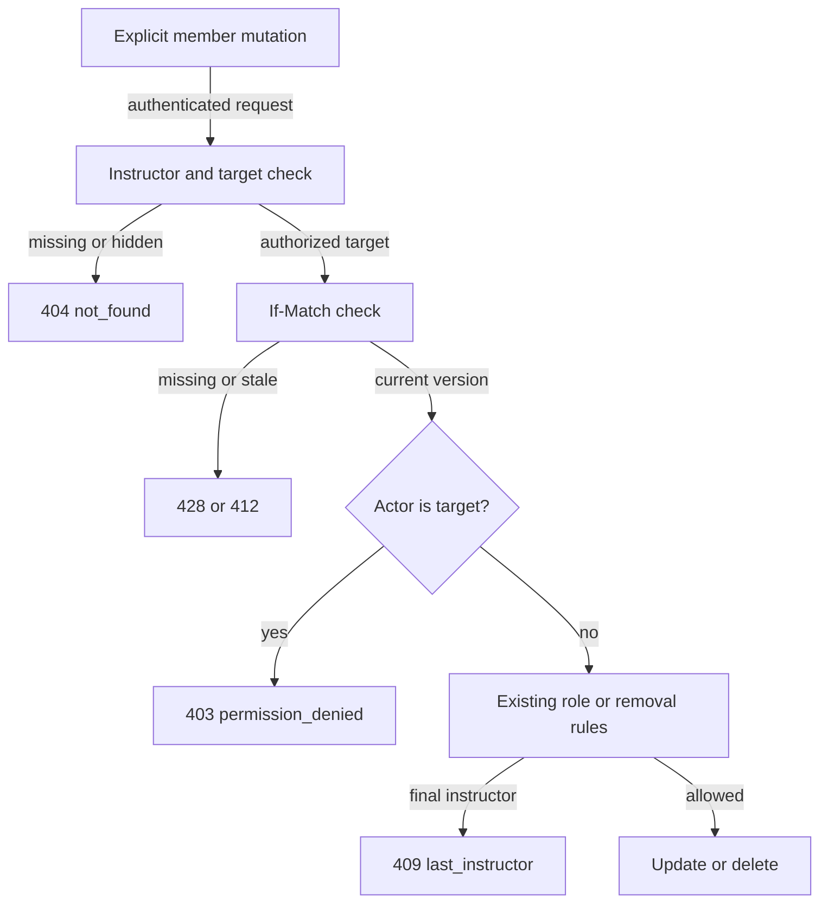

# Prevent self-administration of course membership

Status: agreed
Date: 2026-09-27

## Context

Course settings currently shows an instructor the same role selector and **Remove** action for every member, including themself. The explicit instructor membership endpoints likewise permit changing or removing the caller's own membership when another instructor remains. The separate `DELETE /api/v1/courses/{courseId}/members/me` endpoint already expresses a voluntary departure and protects the final instructor. The agreed rule is that an instructor cannot administer their own membership through the explicit-target endpoints or the settings member row. This is a public API behavior change; no database schema or new endpoint is needed.

## Decision

The authenticated actor may use `PATCH /api/v1/courses/{courseId}/members/{userId}` and `DELETE /api/v1/courses/{courseId}/members/{userId}` only when `userId` identifies **another** member. A self-targeted request returns `403 Forbidden` with the existing `permission_denied` error code, regardless of whether a role PATCH would change the value. Other instructors may still change this instructor's role or remove them, subject to the existing last-instructor rule.

The course service enforces the rule, not just the browser. On each explicit-target operation it first applies the existing instructor authorization and target lookup, returning the existing concealed `404` for an unauthorized actor or missing target. It then applies the existing `If-Match` requirement and comparison (`428` for absent, `412` for stale). Only after those checks does it compare `actorId` and `targetId` and reject a match with `403 permission_denied`, before any role update, deletion, or last-instructor count. This ordering preserves existing authentication, CSRF, validation, concealment, and optimistic-concurrency behavior. It also makes the self-policy outcome consistent regardless of how many instructors remain.

The dedicated `DELETE /api/v1/courses/{courseId}/members/me` route remains unchanged. It is the API path for leaving voluntarily, with its existing `204` success and `409 last_instructor`/`course_deleting` failures. It does not pass through the new explicit-target self check. Course settings hides the role selector and **Remove** button on the current user's row while leaving their identity and role visible. It continues to offer those controls for other members to instructors. Per the user's decision, this change does **not** add an instructor **Leave course** button to settings; the existing API endpoint remains available but is not newly exposed in that UI.

## Contract and verification

Document the new `403 permission_denied` response and self-target prohibition for both explicit-target endpoints in `documentation/api/course-memberships.md` and `documentation/openapi.yaml`. Reuse the existing error code; do not introduce a new enum value. The public membership URL shapes, successful responses, ETag format, and `/members/me` contract are unchanged.

Derive API tests from those references: with at least two instructors, self-targeted PATCH (including a no-op) and DELETE return `403 permission_denied` and leave the membership and version unchanged; another member remains manageable through both operations; unauthorized access stays concealed as `404`; absent/stale `If-Match` retains `428`/`412`; and `/members/me` still permits departure except for the final instructor. Frontend interaction tests verify that an instructor's own row has no administration controls while another member's row does, and a non-instructor sees no administration controls.

## Alternatives rejected

- Browser-only hiding: improves the visible settings page but leaves direct API requests able to bypass the rule.
- Treating a self-targeted explicit DELETE as a leave request: conflates an instructor-only, ETag-protected administrative operation with the separate voluntary leave contract.
- `409 Conflict` for self-targeting: the request is disallowed by actor/target identity regardless of course state, so the existing authorization error `403 permission_denied` is clearer.
- Adding an instructor **Leave course** button: potentially useful, but the user explicitly kept this UI change out of scope.

## Trade-offs and failure modes

The explicit-target API is intentionally less flexible: an instructor who wants to leave must use `/members/me`, and a self-role change requires another instructor. This is deliberate separation of self-service and administration. Older clients that use the explicit-target DELETE to leave will now receive a clear `403`; the dedicated leave endpoint remains available. The frontend restriction is advisory UX; the service remains authoritative if a client bypasses or has stale UI state. If the membership changes concurrently, the existing ETag conflict is returned before the self-policy check, so callers must refresh first.

## Reversibility

The UI control visibility is cheap to revise. The `403` rule is a public API contract change and should be treated as the consequential decision. No persistence or migration decision is involved.

## Open questions

None blocking planning.
