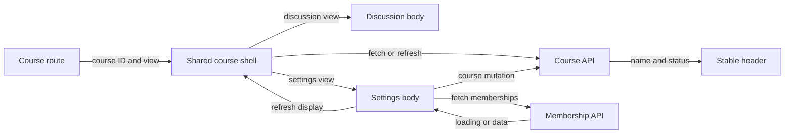

# Smooth course settings transition

Status: agreed
Date: 2026-09-27

## Context

The discussion's **Course settings** link currently permits ordinary browser navigation. That reloads the document, repeats session restoration, and briefly shows the full-screen `Loading ChalkTalk…` view. The settings page then fetches course, current membership, and member list together and replaces the entire page with `Loading course…` until all three finish. Finally, its narrow, large-title layout differs sharply from the discussion header. The user wants the transition to feel continuous and chose a common course header/navigation frame across Discussion and Settings.

The existing paths remain `/courses/:courseId`, `/courses/:courseId/posts/:postId`, and `/courses/:courseId/settings`. The settings body may remain narrower than the discussion columns. No new router, animation library, API endpoint, or persistence layer is needed.

## Decision

Render a stable course shell for all three course routes. The shell owns the course's display identity and status, the shared course heading, **All courses** link, and Discussion/Settings navigation. The route-specific body renders beneath it: the existing two-column feed/detail or a narrower settings panel. Route changes within the same course retain the shell and heading while changing only the body. The active navigation item follows the route, including a selected-post URL.

Use the existing history-based route mechanism for normal in-app clicks. A plain Settings or Discussion click checks the current draft-discard guard when applicable, prevents native document navigation, then uses the app's route change. A rejected discard leaves the URL, selection, and draft unchanged. Preserve native link behavior for modified clicks, middle clicks, and explicit new-tab actions. Direct URL entry and refresh still work through the existing session restore path; seamless internal navigation does not require changing initial boot behavior.

The shell holds the current course's versioned course data for display and passes it to route bodies that need it. Settings owns its member-list, own-membership, action-pending, and form state; it does not own a second, independently rendered course header. Course changes made in Settings update or refetch the shell course data, so a renamed course does not show an old name on return to Discussion. On course ID change or loss of access, invalidate the prior course's data before rendering protected content. No application-wide cache is introduced. The shell can fetch course data while settings-specific requests run; settings' member panel shows its own loading/error state rather than replacing the entire viewport. If settings data is slow, the header and navigation remain visible and usable. A failed course fetch is reported in the shell with retry; a failed membership/member fetch is reported inside Settings with retry. Authorization remains enforced by the API.

Keep the common header's typography, spacing, and placement consistent on both routes; do not animate the whole page to conceal loading. The settings content remains a comfortably narrow form/list column, aligned within the shared page width rather than becoming a separate full-screen layout. No animation is required to meet the continuity goal. If a restrained content entrance is later added, it must not delay interaction, move the common header, or run under `prefers-reduced-motion: reduce`.

On route change, move focus to the new view's heading or main region so keyboard and screen-reader users know the content changed; avoid trapping focus. Give in-panel loading messages `role="status"` or polite live announcement, errors an appropriate alert, and keep navigation available during nonfatal loading. Browser Back/Forward must update the active tab and body without a document reload. The existing unsaved-post confirmation also applies before leaving Discussion for Settings.

## Alternatives rejected

- A CSS-only crossfade or slide over the current routes: it would hide, not fix, the document reload and two full-screen loading states; motion could worsen orientation.
- Only converting the link to client-side navigation: removes the session flash, but the settings loader and unrelated page frame still cause a sharp jump.
- A global course store or new router dependency: adds coordination machinery for one small course-route family; a route-level shell suffices.
- Making the settings body as wide as the discussion split view: discards a useful reading width for member administration without improving header continuity.

## Trade-offs and failure modes

- The shared shell is a modest component-boundary refactor. It centralizes course display data but leaves settings mutations and member state local; both views become dependent on the shell's course fetch.
- On a slow settings request, the stable header and an in-panel loading state remain visible. A membership request failure does not blank the course frame and can be retried. A course fetch failure leaves no stale previous-course identity visible and offers retry.
- On rename/archive/delete, the shell's course data must refresh or be updated from the authoritative API response. A stale request from an earlier course ID must not overwrite the current course. If access is revoked, clear course-specific content and follow the existing unavailable/redirect behavior.
- A direct browser load still shows the app-level session restore before the course shell; this change targets the ordinary in-app transition, not boot-time authentication architecture.

## Reversibility

Header styling and whether to add subtle motion are cheap to revise. The shared-shell ownership boundary is more consequential but internal to the frontend; the public course URLs and API contracts do not change.

## Open questions

None blocking planning. Exact spacing and any optional micro-transition are presentation details, provided the header stays stable and reduced-motion behavior is respected.
