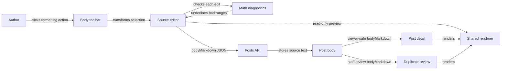

# Markdown and LaTeX in post bodies

Status: agreed
Date: 2026-09-28

## Context

The course post composer currently stores plain textarea text in the existing `bodyMarkdown` field. Full post detail and staff duplicate review already use `react-markdown`, but there is no authoring toolbar, preview, or math parser. Members need familiar Markdown controls and inline/block LaTeX without changing the post API or stored representation. The body remains limited to 100,000 characters by the existing contract; titles, cards, and search results remain plain text.

The user chose a full toolbar (bold, italic, heading, link, bulleted list, numbered list, inline code, inline math, and block math), a read-only Preview toggle, `$...$` inline math, and standalone `$$` display math. The user also chose natural Markdown insertion: line-level controls prefix lines rather than trying to wrap them, while inline controls wrap selected text or place paired delimiters at the caret. After the initial design, the user additionally requested a red underline on syntactically incorrect LaTeX in the editor, with Markdown and math syntax checked after every text edit. The user agreed that unfinished math remains neutral until its closing delimiter exists, and that ordinary Markdown constructs do not receive invented syntax errors. No visual WYSIWYG document model, raw HTML, media upload, or API/schema change is part of this feature.

## Decision

Replace the native textarea with a CodeMirror 6 source editor because a textarea cannot underline a specific source range. Keep the raw draft string as the sole source of truth for publishing. Add an accessible formatting toolbar immediately above the editor and a read-only Preview mode. Toolbar actions transform the draft string using the editor's current selection range, then restore focus and an intentional caret/selection position. They do not call the API. Publishing still sends the raw `bodyMarkdown` string through the existing create-post path; the server stores it as text.

On every editor document change, parse the current Markdown/math source and validate each _complete_ math expression with KaTeX using the same trust and resource limits as rendering. Decorate only expressions that KaTeX rejects with a red underline and a concise diagnostic message. An open `$` or unfinished `$$` block is a normal typing state and receives no error decoration until its closing delimiter appears. CommonMark-style Markdown is intentionally permissive: unmatched formatting markers are ordinary text, not universally invalid Markdown. Reparse Markdown after every change to locate current math spans, but do not promise generic Markdown errors where the rendering grammar has none. The underline is advisory; it does not change the draft or block publication.

Use one safe post-body renderer configuration for composer Preview, ordinary post detail, and staff duplicate detail. Extend the existing `react-markdown` pipeline with `remark-math` for `$`/`$$` parsing and `rehype-katex` for math display. Sanitize untrusted parsed content before KaTeX runs, do not enable `rehype-raw`, preserve the renderer's safe URL handling, and bundle KaTeX CSS/assets locally. An existing post containing Markdown or supported math syntax renders through the same pipeline without data migration.

## Structure

The composer owns the current body string and CodeMirror selection/focus. The formatting operation is a deterministic text transformation with no separate visual document model. When a range is selected, bold, italic, inline code, and inline math surround that range with `**`, `*`, backticks, or `$` respectively. With an empty range they insert paired markers and place the caret between them, so the next typed character lands inside. The link control inserts `[selected label](url)`; with selected text it positions the caret in `url`, and with no selection it positions the caret inside the empty label. Heading uses `### ` so body headings sit below the post title's `h2`; heading and list controls add Markdown prefixes to the current line or each selected line, preserving relative text. Numbered lines receive incrementing markers beginning with `1. `. Block math creates a standalone `$$` line before and after the chosen content, adding line breaks where needed rather than embedding `$$` in prose; an empty selection leaves the caret on the intervening line. Repeated clicks insert syntax; they do not attempt to parse and toggle arbitrary existing Markdown. The text remains editable by hand.

The diagnostic boundary takes source text and returns source ranges plus messages; it never rewrites text and has no server dependency. It uses the same Markdown/math grammar as Preview so code spans, escaped dollars, ordinary prose, and closed math are distinguished consistently. KaTeX parse failures are scoped to the offending expression rather than the whole post. Complete expressions are checked after each edit without the lint package's default 750 ms idle delay; the update must remain responsive at the existing 100,000-character limit. Expensive parsing and KaTeX work must not make input lag, so implementation should use incremental editor facilities or another measured bounded strategy while preserving the per-edit check. If diagnostics cannot finish before the next edit, stale results must not overwrite results for newer source. The editor should not silently drop input or lose caret position when validation fails.

Preview is a read-only rendering of the current draft, not another editing surface or a server round trip. Switching back to Write preserves body text, selection intent, and any unsent form fields. Toolbar buttons are actual buttons with clear accessible names and keyboard focus states; activation must not lose the editor selection before the transform is calculated. The editor remains explicitly labeled as Post body, keyboard-operable, and reachable in a sensible tab order. Red is not the sole diagnostic cue: an invalid expression has an accessible textual message, discoverable by keyboard without announcing a fresh alert on every keystroke. The rendered output provides an accessible representation for math where supported by KaTeX's HTML/MathML output.

The shared renderer is a small frontend boundary: it accepts `bodyMarkdown` and produces React elements. It is used only for full-body views and Preview. Feed cards and Related questions keep escaped plain-text excerpts so a mathematical expression or link cannot turn a compact card into an interactive or oversized surface. This boundary prevents Preview, regular detail, and duplicate review from drifting in Markdown dialect or security policy.

`$...$` denotes inline math; `$$` delimiters on their own lines denote display math. These delimiters are documented in the UI near the math controls. Literal dollar amounts may need escaped dollar signs; `$` syntax is a portability trade-off of the agreed authoring format. Inline code and fenced code are parsed as code, not math. Unsupported or malformed TeX must remain visible as text/error markup rather than blanking the entire post or crashing the detail view.

## Technology choices

| Concern                | Choice                                                                                                          | Why                                                                                                      | Runner-up                                                                           |
| ---------------------- | --------------------------------------------------------------------------------------------------------------- | -------------------------------------------------------------------------------------------------------- | ----------------------------------------------------------------------------------- |
| Editor                 | CodeMirror 6 source editor plus deterministic selection transforms                                              | Supports precise range underlines while retaining raw Markdown source and keyboard editing               | Mirrored textarea overlay is fragile for scroll, wrap, selection, and accessibility |
| Live diagnostics       | Markdown/math parse plus KaTeX validation of complete math spans, surfaced through CodeMirror range decorations | Shares the rendered grammar and pinpoints invalid LaTeX without treating permissive Markdown as an error | Regex-only delimiter checks miss code spans and escaped syntax                      |
| Markdown               | Existing `react-markdown` 10.x                                                                                  | Already renders post detail safely without raw HTML                                                      | HTML conversion/injection increases XSS exposure                                    |
| Math parsing/rendering | `remark-math` 6.x and `rehype-katex` 7.x with locally bundled KaTeX CSS                                         | Matches agreed `$`/`$$` syntax and integrates with the existing unified pipeline                         | MathJax is heavier for this limited math display need                               |
| Untrusted content      | `rehype-sanitize` before KaTeX, `trust: false`, bounded KaTeX expansion/size, safe URL handling                 | Limits HTML/URL and TeX abuse without permitting arbitrary author HTML                                   | Sanitizing KaTeX output afterward requires a much wider MathML/SVG allowlist        |

Versions and maintenance were checked on 2026-09-28 against the [CodeMirror reference and lint API](https://codemirror.net/docs/ref/), [remark-math repository](https://github.com/remarkjs/remark-math), [rehype-katex package and security guidance](https://www.npmjs.com/package/rehype-katex), [KaTeX options](https://katex.org/docs/options), and [KaTeX security guidance](https://katex.org/docs/security). CodeMirror 6 supplies source editing and range diagnostics; its lint extension defaults to a 750 ms delay, so that default does not satisfy the per-edit requirement. The npm registry reported `remark-math` 6.0.0, `rehype-katex` 7.0.1, `katex` 0.18.9, and `rehype-sanitize` 6.0.0. The final dependency versions should remain compatible with the repository's React and unified packages. The sanitizer's default schema preserves the math code class consumed by `rehype-katex` without adding custom class or URL allowances.

## Alternatives rejected

- A WYSIWYG editor: unnecessary for insertion of known Markdown/LaTeX delimiters and introduces a second state/serialization model.
- Keeping the native textarea with a positioned highlight mirror: can paint source ranges, but matching line wrapping, scroll offsets, font metrics, composition, and selection across responsive layouts is a substantial maintenance and accessibility burden.
- Validating Markdown with custom regex rules: Markdown is deliberately permissive, and regex checks would disagree with Preview around escaping and code spans.
- Storing rendered HTML or formula images: makes sanitization and edits harder and changes the API/storage contract when source Markdown already exists.
- Custom dollar-sign parsing: duplicates a maintained Markdown extension and risks disagreements between Preview and detail.
- `\(...\)` and `\[...\]` as the primary syntax: avoids some currency ambiguity but diverges from the agreed syntax and would need additional parser behavior.
- Raw HTML support (`rehype-raw`) or `dangerouslySetInnerHTML`: not required for Markdown/math and materially widens the XSS surface.
- A separate math renderer in Preview: would allow a draft to look different after publishing.

## Trade-offs accepted

The body is still source Markdown in a code-style editor, so authors see syntax while writing; Preview is explicit rather than a full visual editor. CodeMirror adds frontend dependency and integration cost to meet precise live-underlining behavior. Incomplete math is deliberately neutral while typing, so an unmatched delimiter is not immediately flagged; generic Markdown typos may also render as literal text with no warning. Single-dollar inline math can conflict with ordinary currency text unless authors escape it. KaTeX supports a substantial subset of TeX, not every LaTeX package or command. Large bodies or many formulae can be costly to validate/render, so responsive per-edit diagnostics, math resource limits, and avoidance of rendering in list cards are part of the design. Existing PostgreSQL full-text search continues to index raw title/body text; this feature does not promise that searching mathematical meaning or rendered glyphs works.

## Failure modes

- Invalid TeX: underline only the completed failing expression in Write and show readable source/error text in Preview/detail; keep the rest of the post usable. Incomplete math remains neutral while authoring.
- Diagnostic parser slow or throwing: keep editing and publication available, avoid stale/redrawn caret state, and surface a non-spamming status if validation is unavailable; do not corrupt the raw draft.
- Unsafe links, HTML, or TeX commands: render as inert text or reject the unsafe construct; never execute author-supplied HTML/JavaScript or trust external-resource TeX commands.
- Renderer or CSS fails to load: the stored body remains intact and editable; avoid a blank detail pane, and do not depend on a remote stylesheet or service.
- A formatting action at a boundary, multiline selection, or zero-length selection: transform only the intended range/lines and leave a usable caret position; it must not overwrite surrounding text.
- An API create failure: preserve the formatted draft and Preview/Write state in the existing composer; the rendering feature introduces no new persistence path.

## Reversibility

The source-text `bodyMarkdown` API and `$`/`$$` convention are the durable choices: changing the accepted syntax after users author posts may require compatibility parsing or content migration. CodeMirror, diagnostic presentation, toolbar layout, exact button labels, sanitizer configuration, and renderer implementation are comparatively cheap to change because they do not alter stored source. Disallowing raw HTML now avoids committing to a difficult-to-reverse trust policy.

## Verification seam

Frontend interaction tests should model selection start/end and caret insertion against the actual body source editor. For each paired syntax action, assert the resulting string and that subsequent typing lands between delimiters; for heading/list actions, assert prefixes on the intended lines without corrupting neighbors. Include empty and nonempty selections, multiline/block math placement, link caret placement, and keyboard/focus behavior. Diagnostic tests should assert the ranges and messages after every edit: valid complete inline/display math has no red underline, invalid complete math does, unfinished math remains neutral, code spans and escaped dollars are not math, and correcting or deleting an error removes the underline immediately. A long-body interaction check should catch perceptible typing stalls, and keyboard/screen-reader-oriented tests should verify that diagnostic text is available without color alone or repeated live alerts. Rendering tests should verify bold, links, lists, inline and display math in Preview and both detail paths, plus malformed math and hostile HTML/URL content. A sample such as `**cutoff**` should render its selected text inside bold markers, and `$x^2$`/standalone `$$` examples should render the text inside the intended math boundaries. These tests supplement, rather than replace, the current create-post API contract tests.

## Open questions

No structural decisions remain. Planning may refine exact control labels, responsive toolbar layout, and the per-edit diagnostic implementation, provided it preserves prompt feedback and the agreed neutral/in-error semantics.
