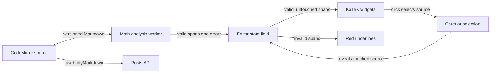

# Render math inside the post editor

Status: proposed
Date: 2026-09-28

## Context

The existing post composer uses CodeMirror 6 to edit raw `bodyMarkdown`. A worker parses Markdown/math on each edit and reports complete invalid LaTeX ranges; Preview and full post views render valid math with KaTeX. The user now wants complete valid `$...$` and standalone `$$` expressions rendered **inside the editable text box** while the caret is elsewhere. Entering an expression should reveal its source for editing. Invalid or unfinished math must remain source text, with the existing red underline and accessible diagnostic for complete invalid math. The toolbar, explicit Preview, raw post API, and keyboard editing remain.

This is a presentation change, not a rich-text data model. It must not modify stored Markdown or the server contract. The user confirmed the same reveal behavior for inline and multiline math: clicking rendered math is an attempt to edit that expression and reveals its source. Selection overlapping an expression also reveals its source so copy, replacement, and toolbar actions operate on the actual Markdown.

## Decision

Keep the CodeMirror document and the composer's `body` state as the sole raw-text truth. Extend the existing math analysis to return both valid complete expression spans (source offsets, TeX content, inline/display mode) and invalid diagnostics. Use CodeMirror replacement decorations to display KaTeX widgets over valid spans only when the current selection does not touch them. The widgets are a view projection: they never replace document characters, enter the API payload, or create a second editable model.

On a selection/caret move into a formula, remove that formula's replacement synchronously so the original delimiters and TeX become editable. When the selection leaves, reapply the replacement using the latest analysis for the current document version. A pointer activation on a widget selects its underlying source range and reveals it. Do not make these ranges atomic by default: atomic cursor movement would skip over hidden source and conflict with the promised keyboard route into a formula. Selection movement, click activation, deletion, undo/redo, and toolbar transforms all retain CodeMirror's raw document coordinates.

The worker remains responsible for Markdown parsing and validation. Its reply carries a source version and is ignored if stale. Do not send HTML across the worker interface; render trusted-by-policy KaTeX DOM locally with the same `trust: false` and resource bounds already used elsewhere. Keep invalid math in source form with the red underline and accessible diagnostic. Keep incomplete math in source form without an error until its closing delimiter exists. If analysis or rendering fails, degrade to editable source rather than blanking text or blocking publishing.

## Structure

The editor's state-backed decoration module owns source-span projections and selection-aware visibility. It presents no new interface to the composer beyond the existing raw `value`/`onChange` and formatting handle. The parser/validator module returns offsets in CodeMirror document coordinates. The renderer module creates only formula widgets; full-body Preview/detail continues through the established shared `PostBody` renderer. These modules share parsing and KaTeX policy but do not share rendered HTML strings.

Display math spans include line breaks. CodeMirror's [decoration reference](https://codemirror.net/docs/ref/) says replacement decorations that cover line breaks must be supplied directly from state, not via a view-function decoration provider. The state field is therefore the necessary seam for inline and display replacements. The [CodeMirror decoration example](https://codemirror.net/examples/decoration/) documents replacement widgets and optional atomic ranges; this design intentionally omits atomic movement to make arrow-key entry reveal source. This API behavior was checked on 2026-09-28.

The worker may finish after the author has typed again. The editor increments the source version on each document change, immediately stops showing a replacement for a changed/selected range, and only applies spans from the matching version. Untouched spans may be mapped across edits if safe, but no stale span may cover newly edited text. A composition/IME edit must reveal the affected expression and must not have its DOM swapped beneath the active composition.

## Alternatives rejected

- Replace the CodeMirror document with rendered HTML or a rich-text document: introduces a second serialization model and risks changing the stored `bodyMarkdown` contract.
- Render math only in the separate Preview: already available, but does not meet the new in-text-box behavior.
- Overlay HTML over the editor: difficult to align with CodeMirror wrapping, scrolling, selections, and multiline display math.
- Return ready-made KaTeX HTML from the worker: creates a second HTML trust boundary and makes DOM/selection behavior harder to localize.
- Treat formula widgets as atomic: simpler navigation but arrow keys cannot enter a formula to reveal its source without extra bespoke key handling.

## Trade-offs accepted

Rendered math can change line height and cause a modest visual reflow when source is revealed. A formula being edited is necessarily shown as source, not rendered simultaneously. Analysis is asynchronous, so a newly completed formula may display briefly as source before the matching worker reply arrives. Each visible formula widget has a rendering cost, especially in long math-heavy drafts; viewport-aware rendering and the existing KaTeX resource limits should bound it without altering stored text.

## Failure modes

- Invalid complete TeX: keep source visible and underlined, retain the accessible diagnostic; do not render a broken widget.
- Unfinished delimiters: keep source visible and neutral; never hide an incomplete expression.
- Stale, failed, or slow worker result: ignore stale results, keep editing available, and leave source visible until current analysis arrives; preserve existing validation-unavailable status.
- KaTeX widget failure: show raw source for that expression; keep the rest of the editor and Preview usable.
- Selection or edit across a widget: reveal touched source before editing; never delete an unseen entire formula merely because it is rendered as one visual object.
- Large or hostile TeX: use the existing untrusted KaTeX limits and avoid rendering outside the visible viewport where practical.

## Reversibility

This is a reversible editor presentation choice: `bodyMarkdown`, delimiters, API shape, and stored source do not change. Widget/decorations strategy, visibility threshold, and click placement can be adjusted independently. The accepted `$`/`$$` syntax remains the durable prior choice.

## Verification seam

Tests should exercise observable composer behavior using real editing and selection interactions, not assert CodeMirror's private decoration structure. Cover complete inline and multiline formulas rendering within the body field; caret, selection, and click revealing exact raw source; invalid and incomplete source remaining visible; red underline and accessible error for invalid complete TeX; transitions from invalid to valid and back; toolbar insertion into revealed source; copy/paste and undo/redo preserving raw text; and publication sending unchanged `bodyMarkdown`. A real-browser smoke check is needed for pointer placement, keyboard movement, IME safety, and narrow-layout reflow because JSDOM cannot validate those browser behaviors.

## Open questions

No new structural decision is required. Planning should settle exact pointer placement within the revealed source and responsive styling, and test selection/caret transitions, copy/paste, undo/redo, IME composition, long documents, invalid-to-valid transitions, and raw API submission. These details must preserve the decision that source is the only editable truth.
