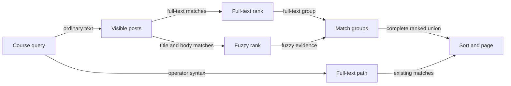

# Fuse post full-text and fuzzy search

Status: approved for implementation
Date: 2026-10-06

## Context

`GET /api/v1/courses/{courseId}/posts` currently requires a full-text match on the generated English `posts.search_vector` when `q` is present. `sort=relevance` uses `ts_rank_cd`; other sorts use timestamps. Every list is scoped to a course and viewer, filters precede pagination, confirmed duplicate sources are absent from ordinary results, and pinned posts sort first. The same endpoint serves the feed and question-composer Related questions. Its `q` supports PostgreSQL `websearch_to_tsquery` syntax: quoted phrases, `OR`, and excluded terms. Cursors bind course, viewer, sort, and normalized filters.

The agreed scope is fuzzy matching across **both titles and bodies**, combined with existing full-text search. Semantic search is outside this change. The existing API allows bodies up to 100,000 characters, so fuzzy indexing and ranking must account for long text. The user chose strict preservation of operator semantics; an operator query may use only the current full-text path. For relevance sorting, the full-text tier is an absolute priority over the fuzzy-only tier within each pinned group. Fuzzy evidence can reorder results inside an eligible tier, and title matches receive preference over body matches. Fuzzy matching requires at least three searchable characters per term.

## Goals / Non-Goals

**Goals:**

- Surface misspelled ordinary-query terms found in either a title or body, while retaining exact and inflected full-text matches ahead of fuzzy-only results under relevance sorting.
- Keep operator queries, course and identity boundaries, all filters and sorts, and the complete pagination contract intact.
- Keep search within PostgreSQL and the existing posts list API.

**Non-Goals:**

- Embeddings, semantic similarity, a new search service, or fuzzy interpretation of quoted phrases, `OR`, or exclusions.
- Searching answers, attachments, resources, or other content outside post title and body.
- A new result cap, public score field, API parameter, or frontend search mode.

## Decisions

### One API boundary chooses the search path

The server, not the browser, classifies `q`. If it contains web-search operators or its interpretation is ambiguous, it uses the current `websearch_to_tsquery` match and `ts_rank_cd` relevance path. This includes quoted phrases, `OR`, and excluded terms; their inclusion and exclusion rules remain exact. Ordinary text enters the fused path. The browser continues sending the trimmed query unchanged. Composer-generated multi-term queries currently join terms with `OR`, so those Related questions requests remain full-text-only and unchanged. A composer query without an operator follows the ordinary-query path; changing the composer query construction itself requires a separately agreed change.

The matching set for ordinary text is the union of full-text and fuzzy matches. All existing filters apply to both branches. In particular, deleted posts, confirmed duplicate sources, nonmember content, and posts excluded by viewer-aware author filters cannot enter candidate ranking or affect `hasMore`. The staff-only confirmed-duplicate review remains on its existing full-text path.

### Fuzzy matching is word-level in both fields

Use PostgreSQL `pg_trgm` word-boundary similarity for ordinary positive query terms against both `title` and `body_markdown`. A whole-query versus whole-body similarity score would fall as unrelated body text grows; word-level matching permits a misspelled term within a long post to qualify. A fuzzy term must contain at least three searchable Unicode letters or digits after normalization. Ignore shorter terms and English stopwords in the fuzzy branch; if no eligible term remains, use full-text search alone. Require each eligible term to match a word in either field above the chosen threshold; a term may match the title while another matches the body. For ranking, prefer a title match over an otherwise equal body match, then combine the best per-term similarities. Apply the title preference to ordinary full-text ranking as well, without changing the existing full-text match predicate or the operator-query path. Thresholds and boost magnitudes are internal tuning parameters, not public API promises.

Retain the generated full-text vector and its GIN index. Add separate trigram indexes for active ordinary-search titles and bodies, and evaluate GIN versus GiST against the actual query shape before finalizing index type. Both support indexed similarity predicates; GiST can additionally support nearest-neighbor ordering. An index on the body adds storage and write cost, which is the accepted consequence of the user's body-search decision. `pg_trgm` availability and install privileges are deployment prerequisites, including in test databases with isolated schemas.

### Relevance orders complete match groups

For ordinary text, split the complete union into two mutually exclusive tiers: posts matched by the current English full-text predicate, and posts matched only by fuzzy search. "Full-text match" includes stemming and stop-word behavior; it does not require a character-for-character match. Under `sort=relevance`, retain pinned-first ordering, then put **every** full-text match ahead of **every** fuzzy-only match within each pinned group, regardless of fuzzy score. No fuzzy-only score may cross that boundary. This preserves the existing pinned-first API contract while enforcing the approved absolute match priority. A post found by both branches belongs to the full-text tier once, never twice.

Rank inside the full-text tier using both full-text relevance and fuzzy evidence when available; rank inside the fuzzy-only tier using fuzzy evidence. Reciprocal rank fusion **within the full-text tier only** avoids adding raw `ts_rank_cd` and trigram scores with incompatible scales. Title preference applies in both branch rankings. Fuzzy-only ordering uses its title-weighted fuzzy rank. Resolve every remaining tie by post ID. Operator queries retain their existing full-text rank order. When a caller chooses `newest`, `oldest`, or `recent_activity`, that explicit sort takes precedence over relevance tiers, but the ordinary-query match set remains the complete union.

Do not cap either branch to a fixed top N. A cap would cause valid later pages to disappear or make `hasMore` false while matching posts remain. Apply keyset pagination to the **final** ordering: pinned state, match group, within-group rank, then post ID for ordinary relevance; the current keys for operator relevance and timestamp sorts. Carry the match group and stable numeric rank representation in ordinary-relevance cursors. Keep the existing course/viewer/filter binding and add a ranking-algorithm version so pre-change relevance cursors fail with `400 invalid_request` rather than being replayed against a different order. As today, edits between page requests may move results; no cross-request snapshot is promised.

### Migration and deployment

`pg_trgm` is a PostgreSQL supplied extension, not an application package. Its presence in `pg_available_extensions`, installation permission, and stable schema visibility must be checked in every target database before enabling the new query path. The repository currently uses `postgres:17-alpine` locally and has no migration enabling `pg_trgm`. The extension and indexes belong to a new migration; changing the stored full-text vector or backfilling posts is unnecessary. An unavailable extension blocks rollout rather than silently changing search semantics. Index creation over existing long bodies may be substantial; planning must select a migration strategy appropriate to the production table size and the transaction-wrapped migration runner.

The endpoint and data ownership remain in the API and PostgreSQL. No worker, embedding model, external index, or new runtime service is required. Record query latency, candidate counts, index size, and PostgreSQL query plans before and after rollout. If full-set ranking exceeds the latency budget, optimize the SQL or indexing while preserving complete pagination; a top-N truncation would require an explicit product-contract change.

## Alternatives rejected

- Fuzzy fallback only when full-text returns nothing: a weak lexical hit would suppress a stronger typo match, so it does not provide fused ranking.
- Adding raw full-text and trigram scores: their numeric scales differ and thresholds would make ordering harder to reason about than rank fusion within the full-text group.
- Global rank fusion without match groups: it can place a fuzzy-only post ahead of a full-text match, contrary to the agreed result priority.
- Fixed per-branch candidate windows: later pages could omit matches despite the existing cursor and `hasMore` contract.
- Fuzzy matching operator queries: it could reintroduce excluded terms or weaken a quoted phrase.
- A separate search service: it adds a second index and synchronization path without a demonstrated need at the current scale.

## Failure modes and trade-offs

- If `pg_trgm` is unavailable or a migration lacks privilege, the migration fails before the new search path is deployed. Existing full-text search remains available on the old version.
- A very common term may produce many fuzzy candidates. Terms below three searchable characters stay on the full-text path; query cost for broader terms must be measured. A slow query should use the API's normal error/retry behavior, not silently return a truncated result set.
- A missing or stale trigram index affects latency, not correctness, because PostgreSQL can still evaluate the predicates. An index build or body edit can increase database CPU, storage, and write time.
- A post edited, pinned, merged, or deleted between pages may change position or eligibility. The cursor guarantees deterministic continuation for an unchanged matching set, not snapshot isolation across requests.
- A fuzzy threshold can admit weak matches or miss unusual spellings. It is tunable without changing the public API, while the title-and-body scope and operator semantics are product commitments.

## Reversibility

The internal fuzzy threshold, title boost, rank-fusion constant, and index choice are comparatively cheap to tune. Changing ordinary-query result membership, full-text-before-fuzzy priority, operator semantics, or the cursor contract is more consequential because clients and bookmarked searches observe them. Installing `pg_trgm` and indexing long bodies add operational cost, but the extension and indexes can be removed after reverting the search path; there is no new durable post data model.

## Open questions for planning

- What are the production post count, body-size distribution, and concurrent search rate? Use representative data to set the fuzzy threshold, branch weight, index type, and acceptable query latency.
- Can each deployment install `pg_trgm` in a schema visible to application and isolated integration-test connections? Resolve that prerequisite before migration approval.

PostgreSQL 17 `pg_trgm` capabilities and extension privileges were checked against the [official documentation](https://www.postgresql.org/docs/17/pgtrgm.html) on 2026-10-06.
